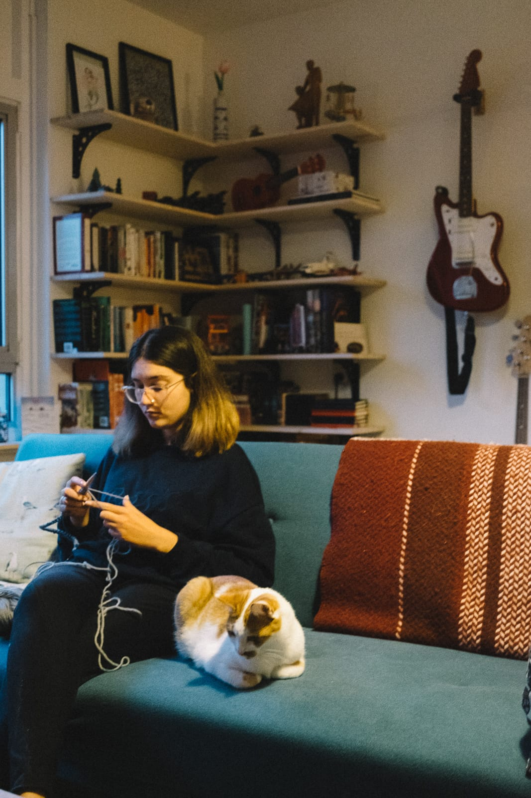
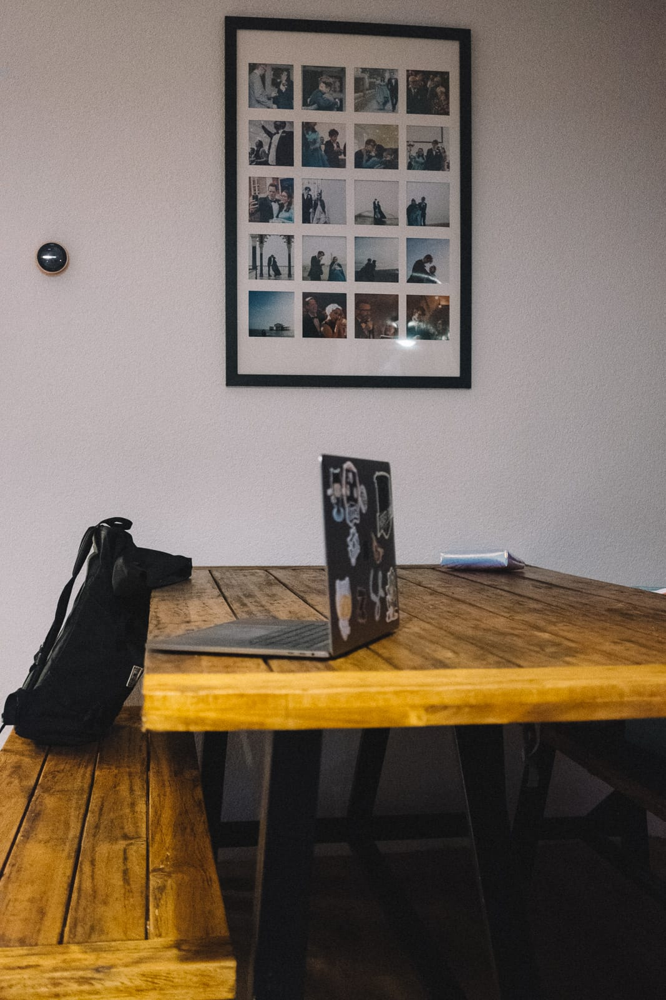
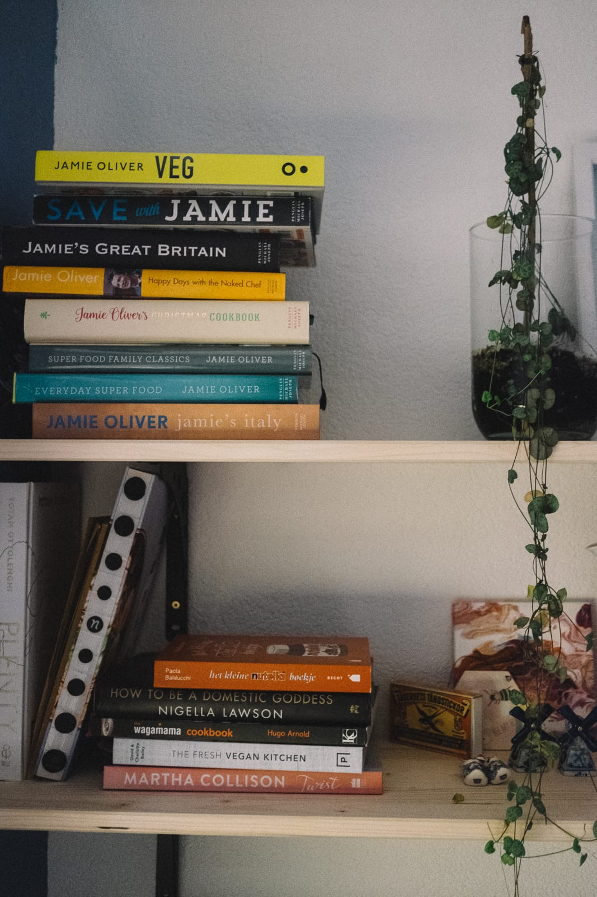
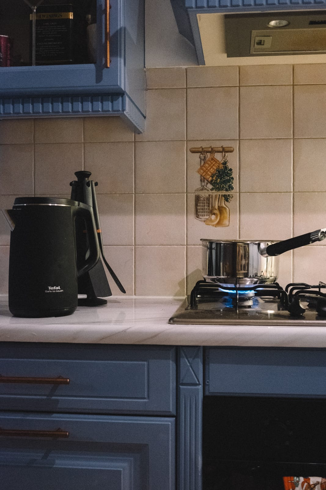
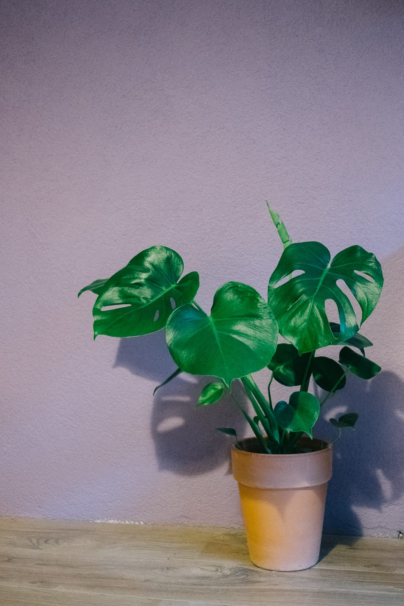
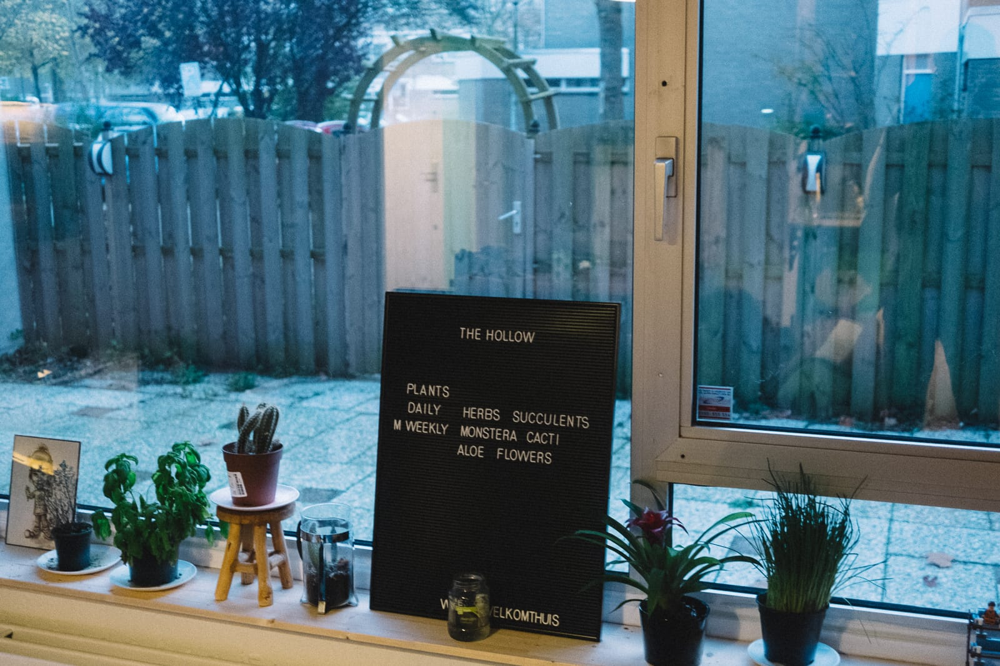

Over the last few months we've taken upon one of the most exciting life changes in a while. Back in May we started hunting for a new aparment, after some extremely generous and sacrifical gifts. A place that would be truely ours. At the end of August, after a lot of searching, bidding, losing, tears, and prayer, we had a new set of keys.

The day after that, two weeks flew by, mostly filled with more paint than I ever thought would be necessary. Two weeks filled with patience and love from my Dad and sister who, like absolute heroes, gave up their time to make our new place feel right. We tore stuff up and out, laid floors, we scrubbed. We made it our own.

This place means many things to us. We've put our roots down in this city and country, we now call home. It's quite easy to move away from a rented property, but now we own something we're not just going to pack our bags and leave. We're here to stay.

I hope that we can turn this home into something for others as well. A place of refuge, a home to a community we've built here, to friends in need, and those who visit. I know, for some, we already have; through smiles, laughter, food, and peace.

These last two months have flown by. I struggle to remember many occassions where the table hasn't been surrounded by friends. I look forward to seeing how our adventure unfolds here, the people we'll meet and host in our home. The places we'll go, always returning to our base camp.

