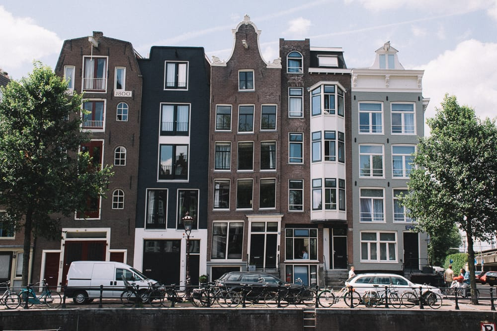

Last updated: {{ page.date | readableDate}}

## Welkom bij Amsterdam! 🌷
Hey! This is my little guide to Amsterdam. Indy and I have been living here since March 2017, and although we still sometimes feel quite new to the city we've done most of the standard tourist things when family and friends come to visit. We know what's different and some things to watch out for. Hopefully this guide assists you in your visit.

### General info
You might be here on vacation, but many live and work in the city. Being a respectful tourist keeps it nice for those people and ensures you'll have a gezellig experience of Dutch culture.

Cyclists here rule the roost. Keep out the cycle lanes, they're unforgiving and dangerous. You can get seriously hurt by a bike hitting you, and they don't stop as quickly as you might thing. The cycle lanes are pained red / purple and are normally split off from the pavement.

A coffee shop is where you buy weed. A cafe or coffee house is where you drink coffee.

Public toilets for women don't really exist yet, it's getting better but very slowly. There's several public urinals around the city for men. If you are a woman (or man who likes some privacy) public toilets are normally €0.50 - €1.

### Getting around
Getting around in Amsterdam is a simple a fair. Most cycle, some others walk or get public transportation. Few drive.

#### By bike
When I say bike, I mean bicycle not moped (don't hire one of those!). Nearly everyone in Amsterdam owns a bike, there are actually more bikes in the Netherlands than people. As a pedestrian, you'll need to watch yourself in the "big city" of Amsterdam. Further out of the city, cyclists are a little more friendly. There's a fun history to bikes in Amsterdam, but that's for another time.

I'd really recommend you don't cycle unless you've cycled in your own country in the last few years and are able to use your hands to signal. If you're not confident on a bike, this really isn't the place to learn.

Hiring a bike here isn't cheap, as most own. If you're here for a longer period of time it might be worth looking into getting a [SwapFiets](https://swapfiets.nl/). Another option, if you have a friend living here is an [OV Fiets](https://www.ns.nl/en/door-to-door/ov-fiets).

Make sure when cycling you abide by the laws, regardless of what other cyclists are doing around you - obey the laws. Two wrongs don't make a right, after all.
- Look left, keep right.
- Obey traffic signs (no access, and traffic lights).
- Use hand signals.
- Use a light at night.
- Stay in the bicycle lanes, they're marked clearly. Don't cycle on the pavement or down tram tracks. If you think you're in the wrong place on the road, you probably are.
- If you need to cross a tram track, do it at an angle.
- There's lots of traffic, trams, taxis, scooters/mopeds, delivery vans, cars, pedestrians, and other cyclists.
- Other cyclists need to pass you, keep to the right of the lane, never cycle more than 2 abreast, and if you hear a bell behind move over.
- Avoid rush hour, between 8a-9a and 5p-6p everyone is going to/from work. If you're new it's intimidating.
- AGAIN. Don't follow the locals through red lights, or without lights. We're a bad example, it's dangerous, and you can get hefty fines.

#### Public transportation
Trains, metro, trams and buses are plentiful in the Netherlands. And they're really cheap. There's never a need to get a taxi or Uber, you can always manage the longer journeys with a combination of the friendly public options. You can use Google maps or [9292.nl](https://9292.nl/) to plan transportation routes.

There's a direct train from the airport to the main station. Don't get a taxi from the rank. Don't get into a taxi if someone approaches you offering their services. If you _must_ get a cab, call for an Uber - even then it'll cost at least €30 from airport to Amsterdam.

#### Car / Scooters
You can drive a car or scooter in most places in Amsterdam. Both a bad ideas unless you have a need. On the narrow canal rings things often get very busy. If you're driving to Amsterdam (ie, roadtrip across Europe) you're best to find some cheap / free parking outside the city and get a metro into the city. Some areas of Amsterdam have fees of over €6 / hour for parking.

Scooters/mopeds also exist in Amsterdam. Thankfully, the beginning of 2019 regulation started coming in to limit them more as they were beginning to get pesky and dangerous.

#### Walking
Finally, there's walking. Amsterdam is quite a small city, and you can get quite far quite quickly just by walking. And, if you're planning on stopping lots to enjoy the sights, cafes, and everything else Amsterdam has to offer, you might find this is the best option for you.

### Food & Drink
As a Western European city, Amsterdam is packed full of fantastic food and drink culture. It's a little behind places like London and Berlin in terms of dealing with allergens and dietary requirements (the Dutch love their cheese and cold meats), but you'll find something that'll suit most people. My recommendations are a little like me; vegetarian and dairy free options will exist in the following places.

#### Coffee
I love my coffee (the drink, not weed) - here are some of my favorite spots.

My local, I'm here regularly - [Good Beans](https://fuckingstrongcoffee.amsterdam/) @ [Binnen Oranjestraat 4, 1013 JA](https://www.google.com/maps/place/Good+Beans/@52.3823672,4.8873037,15z/data=!4m2!3m1!1s0x0:0xfa947614f8adcac5?sa=X&ved=2ahUKEwj1n7KvyrziAhWMJlAKHVj0Bj0Q_BIwCnoECA8QCA)

One of the few roasters in Amsterdam - [Lot Sixty One](https://lotsixtyone.com/) @ [Kinkerstraat 112, 1053 ED](https://www.google.com/maps/place/Lot+Sixty+One+Coffee+Roasters/@52.366834,4.8681123,17z/data=!3m1!4b1!4m5!3m4!1s0x47c609e06fa3f911:0xd77ac43639e1d9a9!8m2!3d52.366834!4d4.870301)

Friendly, hipster, a little poncey - [Coffee Sometime](http://www.coffeesometime.nl/) @ [Eerste Constantijn Huygensstraat 63, 1054 BT](https://www.google.com/maps/place/Coffee+Sometime/@52.3675061,4.8628523,15z/data=!4m5!3m4!1s0x0:0x49eaa5cbb4f6a4c4!8m2!3d52.363261!4d4.8751509)

More of a commercial roaster - [Bocca Coffee](https://www.bocca.nl/) @ [Kerkstraat 96HS, 1017 GP](https://www.google.com/maps/place/Bocca+Coffee/@52.3644467,4.8846387,17z/data=!3m1!4b1!4m5!3m4!1s0x47c609dc41cac6d7:0xfc6a1e41168ca97a!8m2!3d52.3644467!4d4.8868274)

#### Beer
There's a lot of good places for a beer in Amsterdam, including several breweries in the city. Here, it's served in measures of 250ml but it's also a lot stronger normally around 6% but can reach 12%.

Multiple locations, fantastic pale ales and blondes - [Brouwerij Troost - De Pijp](https://brouwerijtroost.nl/depijp-amsterdam/) @ [Cornelis Troostplein 21, 1072 JJ](https://www.google.com/maps/place/Brouwerij+Troost/@52.3681881,4.860774,13z/data=!4m9!1m3!2m2!1stroost!6e2!3m4!1s0x0:0x22b5910e2dfb62cc!8m2!3d52.3504999!4d4.8909867)

It's in a windmill - [Brouwerij 't IJ](http://www.brouwerijhetij.nl/) @ [Funenkade 7, 1018 AL](https://www.google.com/maps/place/Brouwerij+'t+IJ/@52.3666926,4.9242268,17z/data=!3m1!4b1!4m5!3m4!1s0x47c6090b41c8f893:0x77fe1349de1f4bc4!8m2!3d52.3666926!4d4.9264154)

#### Food
We really don't eat out all that much, there's plenty of places I'd love to go visit for the first time (so they're not on this list) but generally food is expensive and I'm often left feeling like I could've done a better job. Here are some of the few places that go beyond expectations. This isn't to say there aren't many great places, my experiences are likely strongly linked to my dairy allergy.

Vegan Fast Food - [Vegan Junk Food Bar](https://www.veganjunkfoodbar.com) @ [Marie Heinekenplein 9, 1072 MH](https://www.google.com/maps/place/Vegan+Junk+Food+Bar/@52.3828616,4.8820054,15z/data=!4m5!3m4!1s0x47c609ed47026f37:0x5b266bccd510acdd!8m2!3d52.3572385!4d4.891575)

A good sandwich - [STACH](http://stach-food.nl/) @ [various locations](https://www.google.com/maps/search/stach/@52.3664103,4.8750096,14z)

Asian Fusion - [HappyHappyJoyJoy](https://happyhappyjoyjoy.asia/nl) @ [Bilderdijkstraat 158HS, 1053 LC](https://www.google.com/maps/place/Happyhappyjoyjoy+West/@52.3675076,4.8694182,17z/data=!3m1!4b1!4m5!3m4!1s0x47c609e081b170c1:0xa10f63d7a03f0c89!8m2!3d52.3675076!4d4.8716068)

The best fries - Vlaams Friteshuis Vleminckx @ [Voetboogstraat 33, 1012 XK](https://www.google.com/maps/place/Vlaams+Friteshuis+Vleminckx/@52.3775303,4.8706965,14z/data=!4m8!1m2!2m1!1sfood!3m4!1s0x0:0x7249bc1642186222!8m2!3d52.3678993!4d4.8910081)

A hummus bistro - [d&a](https://dna-hummusbistro.com/) @ [Westerstraat 136, 1015 MP](https://www.google.com/maps/place/Hummus+bistro+d%26a/@52.3828616,4.8820054,15z/data=!4m5!3m4!1s0x47c609d005adb349:0xf952217fed0c6333!8m2!3d52.3784317!4d4.8826728)

### Things to see & do
#### Amsterdam
You've come to Amsterdam for a reason, and that's probably so that you can see some of the great things this Dutch capital has to offer. I've done a lot of touristy things, and there's enough around to keep you busy for months if money is no issue.

- Wandering the Jordaan - the Jordaan district is one of the prettiest of Amsterdam. It's well worth taking the time to walk around, peer at the quirky, tall canal houses, wander The 9 Streets (De 9 Straatjes) and stop at a cafe or two.
- Boat trips - with the center of Amsterdam being mostly canal, it's amazing how much the view differs from a boat than the road. I love to hire a boat with some friends and cruise in my own chosen areas. You can also join a guided tour, the smaller ones are better, [Those Dam Boat Guys](https://www.thosedamboatguys.com/), for example.
- Amsterdam Bos - the forest of the city. Filled with wildlife and birds, there's even a goat farm which sells goat milk ice cream!
- Anne Frank huis - tickets will book up months in advance. If you're quick they release tickets for the same day every morning. It's "nice" (in a sad way) to visit, but in ways a little bit of a weird experience too due to how touristy it is. I'd recommend the Corrie ten Boom huis instead (see below).
- Rijksmuseum - full of the Dutch classics, a grand building which you can cycle through the middle of. Again, nice to visit, but if you're not a fan of the Dutch masters it might not be the place for you.
- Stedelijk museum - design, modern, and contemporary art. One of my favourite art museums, but it's all personal taste.
- Van Gogh musuem - what it says on the tin. A nice experience and the special / guest exhibits can be really good.

#### Elsewhere
The Netherlands is a big place, after all. Trains are cheap and a day trip or two couple be nice if you're here for a while.

- Corrie ten Boom huis in Haarlem - a great alternative to Anne Frank huis. In my opinion, better in many ways. Smaller, personal, and guided tours that don't feel over crowded and touristy.
- Zaandijk - a nice sandy beach right next to a large nature reserve with deer and Scottish cows.
- Zaanse Schans - a collection of beautiful, historic windmills north of Amsterdam.
- Marken, Volendam, and Edam - three smaller towns north of Amsterdam. A cycling distance for the fit, but the train route is also lovely.

